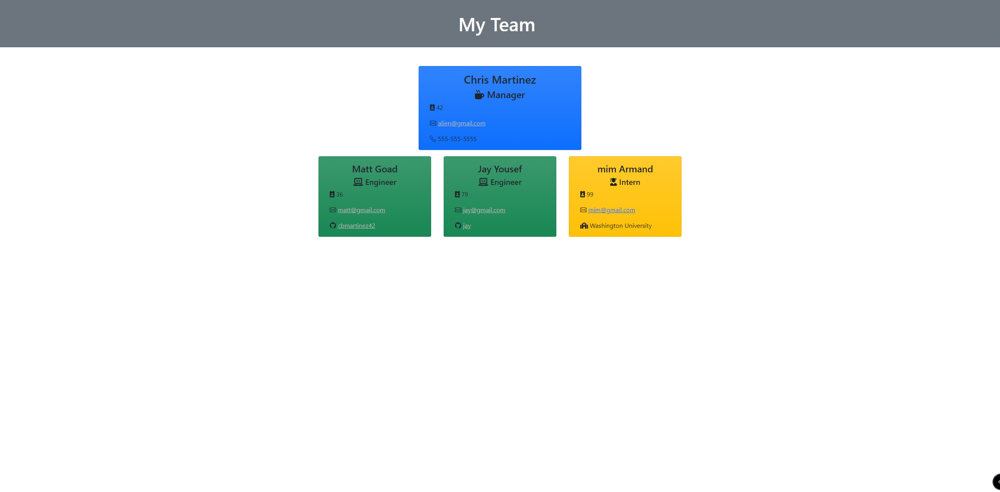

# Team Profile Generator

This is an original application create a team profile through a Command Line Interface

Link to sample HTML file: [Sample](./sample-employees.html)  
Screenshot of sample:     

  
A [video walkthrough](https://www.youtube.com/watch?v=W_ol_5Q7t8E) is also available

## Features
* Utilizes JavaScript and Node.js to provide a simple user interface
    * Inquirer module for command prompts
    * Jest module for tests
* Utilizes class constructors to unify object data for different role types

### Challenges
* Overall I've struggled with utilizing class constructors for Object Oriented Programming. My tutor was able to help clarify the usage of these and how they interact with the overall programming framework
* Creating tests was also a challenge. The instructions provided helped with knowing that elements to test, and I was able to get assistance from classmates in determining the proper way to test my class constructors

## Credits
Many thanks to the below individuals who provided input and suggestions
* Mim Armand
* Andrew Hardemon (stand-in tutor)
* Jay Yousef
* And last, but not least - *Grogu*
        

If any additional issues are found, or if there are any suggestions for improvement, please send an email to developer Chris Martinez at cbmartinez42@gmail.com

---

### <ins>Installation</ins>
1.  Clone or download .zip file from Github to your local computer
2.  In Git Bash or Terminal, type `npm install` to install the necessary modules
3.  When ready, type `node .` to launch `index.js`

#### <ins>Cloning</ins>
1. From Github, select the "Code" button, choose either HTTPS or SSH as appropriate
2. Click the copy button  to add it to your clipboard
3. In your preferred command line (terminal, bash, etc), navigate to the folder you'd like to download the repository into
4. Type `git clone [pasted url from clipboard]` and press enter

#### <ins>Zip file</ins>
1. From Github, select the "Code" button, then select "Download ZIP"
2. Choose which folder to download the repository into via the dialog box that appears
3. After downloading, open the .zip file and select "Extract All" from the top of the window that appears

---

This application is covered under [MIT License](./LICENSE)

